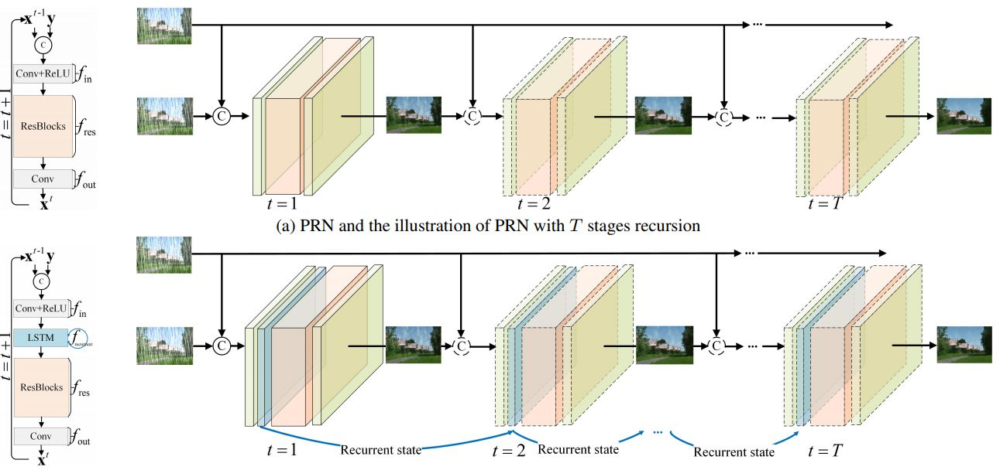

# PReNet_paddle

## 目录


- [1. 简介]()
- [2. 数据集和复现精度]()
- [3. 准备数据与环境]()
    - [3.1 准备环境]()
    - [3.2 准备数据]()
    - [3.3 准备模型]()
- [4. 开始使用]()
    - [4.1 模型训练]()
    - [4.2 模型评估]()
    - [4.3 模型预测]()
- [5. 模型推理部署]()
    - [5.1 基于Inference的推理]()
    - [5.2 基于Serving的服务化部署]()
- [6. TIPC自动化测试脚本]()
- [7. LICENSE]()
- [8. 参考链接与文献]()


## 1. 简介

Progressive Image Deraining Networks: A Better and Simpler Baseline提出一种多阶段渐进的残差网络，每一个阶段都是resnet，每一res块的输入为上一res块输出和原始雨图，另外采用使用SSIM损失进行训练,进一步提升了网络的性能，网络总体简洁高效，在各种数据集上表现良好,为图像去雨提供了一个很好的基准。


<div align="center">
    
</div>

**论文:** [Progressive Image Deraining Networks: A Better and Simpler Baseline](https://arxiv.org/pdf/1901.09221v3.pdf)

**参考repo:** [https://github.com/csdwren/PReNet](https://github.com/csdwren/PReNet)


在此感谢[MSSIM](https://github.com/AgentMaker/Paddle-MSSSIM)，提高了论文复现的效率。

## 2. 数据集和复现精度

验收标准：Rain100H数据集,PReNet模型,psnr=29.46, ssim=0.899

复现精度：Rain100H数据集,PReNet模型,psnr=29.46, ssim=0.899

| Epoch | 30     | 50     | 70      | 90    | 100    | 
| ----- | ------ | ------ | ------ | ------ | ------ | 
| psnr  | 82.44% | 82.87% | 82.93% | 83.12% | 83.29% | 
| ssim  | 82.44% | 82.87% | 82.93% | 83.12% | 83.29% | 


## 3. 准备环境与数据

### 3.1 准备环境

* 下载代码

```bash
git clone https://github.com/simonsLiang/PReNet_paddle.git
cd PReNet_paddle
```

* 安装paddlepaddle

```bash
# 需要安装2.2及以上版本的Paddle，如果
# 安装GPU版本的Paddle
pip install paddlepaddle-gpu==2.2.0
# 安装CPU版本的Paddle
pip install paddlepaddle==2.2.0
```

更多安装方法可以参考：[Paddle安装指南](https://www.paddlepaddle.org.cn/)。

* 安装requirements

```bash
pip install -r requirements.txt
```

### 3.2 准备数据

您可以从[BaiduYun](https://pan.baidu.com/s/1Oym9G-8Bq-0FU2BfbARf8g)下载RainTrainH.zip,Rain100H.zip

```bash
unzip RainTrainH.zip
unzip Rain100H.zip                                                        
```

### 3.3 准备模型

如果您希望直接体验评估或者预测推理过程，可以直接根据第2章的内容下载提供的预训练模型，直接体验模型评估、预测、推理部署等内容。


## 4. 开始使用

### 4.1 模型训练

* 单机单卡训练
需保证save_path路径已存在
```bash
export CUDA_VISIBLE_DEVICES=0
python train_PReNet.py --data_path ./RainTrainH --save_path ./log
```

部分训练日志如下所示。

```
[Epoch 65, iter: 600] lr: 0.00004, loss: -0.90461, avg_reader_cost: 0.00018 sec, avg_batch_cost: 0.16442 sec, avg_samples: 18.0, avg_ips: 109.47310 images/sec.
[Epoch 65, iter: 700] lr: 0.00004, loss: -0.89737, avg_reader_cost: 0.00018 sec, avg_batch_cost: 0.16499 sec, avg_samples: 18.0, avg_ips: 109.09891 images/sec.
[Epoch 65, iter: 800] lr: 0.00004, loss: -0.90011, avg_reader_cost: 0.00018 sec, avg_batch_cost: 0.16469 sec, avg_samples: 18.0, avg_ips: 109.29738 images/sec.
[Epoch 65, iter: 900] lr: 0.00004, loss: -0.90944, avg_reader_cost: 0.00018 sec, avg_batch_cost: 0.16455 sec, avg_samples: 18.0, avg_ips: 109.38969 images/sec.
[Epoch 65, iter: 1000] lr: 0.00004, loss: -0.89040, avg_reader_cost: 0.00017 sec, avg_batch_cost: 0.16437 sec, avg_samples: 18.0, avg_ips: 109.50791 images/sec.
[Epoch 66, iter: 100] lr: 0.00004, loss: -0.88260, avg_reader_cost: 0.00355 sec, avg_batch_cost: 0.16936 sec, avg_samples: 18.0, avg_ips: 106.28161 images/sec.
[Epoch 66, iter: 200] lr: 0.00004, loss: -0.89613, avg_reader_cost: 0.00018 sec, avg_batch_cost: 0.16438 sec, avg_samples: 18.0, avg_ips: 109.50329 images/sec.
[Epoch 66, iter: 300] lr: 0.00004, loss: -0.91299, avg_reader_cost: 0.00017 sec, avg_batch_cost: 0.16440 sec, avg_samples: 18.0, avg_ips: 109.49193 images/sec.
[Epoch 66, iter: 400] lr: 0.00004, loss: -0.86077, avg_reader_cost: 0.00017 sec, avg_batch_cost: 0.16451 sec, avg_samples: 18.0, avg_ips: 109.41454 images/sec.
```


### 4.2 模型评估

该项目中，训练与评估脚本相同，指定`--test-only`参数即可完成预测过程。

```bash
python test_PReNet.py --data_path ./Rain100H --logdir ./logs/net_latest.pdparams
```

期望输出如下。

```
rain-098.png :  0.016921281814575195
rain-099.png :  0.016952991485595703
rain-100.png :  0.01595759391784668
Avg. time: 0.017012195587158205

==> Valid. psnr: 29.4522, ssim: 0.8980

```

### 4.3 模型预测


```
python predict.py --data_path data/rain-001.png --save_path ./results  --logdir ./logs/net_latest.pdparams

```

对于下面的图像进行预测

<div align="center">
    
</div>
得到
<div align="center">
    
</div>


## 5. 模型推理部署

### 5.1 基于Inference的推理

Inference推理教程可参考：[链接](./deploy/inference_python/README.md)。

### 5.2 基于Serving的服务化部署

Serving部署教程可参考：[链接](deploy/serving_python/README.md)。


## 6. TIPC自动化测试脚本

以Linux基础训练推理测试为例，测试流程如下。

* 准备数据

```bash
unzip RainTrainH.zip
unzip Rain100H.zip                                                        
```

* 运行测试命令

```bash
bash test_tipc/test_train_inference_python.sh test_tipc/configs/PReNet/train_infer_python.txt lite_train_lite_infer
```

在终端中会显示下面的内容

```
 Run successfully with command - python3.7 train.py --output-dir=./log/PReNet/lite_train_lite_infer/norm_train_gpus_0 --epochs=1   --batch-size=32!  

 Run successfully with command - python3.7 test_PReNet.py --data_path ./Rain100H --logdir ./logs/net_epoch100.pdparams --pretrained=./log/PReNet/lite_train_lite_infer/norm_train_gpus_0/latest.pdparams!
```


* 如果运行失败，可以先根据报错的具体命令，自查下配置文件是否正确，如果无法解决，可以给Paddle提ISSUE：[https://github.com/PaddlePaddle/Paddle/issues/new/choose](https://github.com/PaddlePaddle/Paddle/issues/new/choose)；如果您在微信群里的话，也可以在群里及时提问。


## 7. LICENSE

本项目的发布受[Apache 2.0 license](./LICENSE)许可认证。


## 8. 参考链接与文献

1. [Progressive Image Deraining Networks: A Better and Simpler Baseline](https://arxiv.org/pdf/1901.09221v3.pdf)
2. MSSIM: https://github.com/AgentMaker/Paddle-MSSSIM
